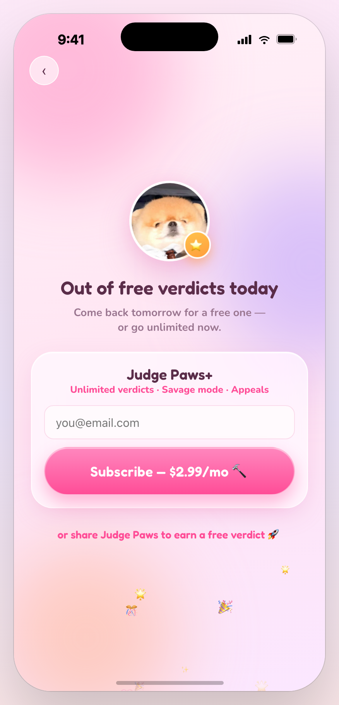

# ⚖️🐾 Judge Paws

> The first AI relationship court. Bring your dispute — a jury of AI dogs decides.

A full-stack build by **[Skylar](https://github.com/SkylarWJY)**: a landing page with
waitlist capture, an interactive courtroom app, and an AI verdict engine powered by
**Claude Opus 4.8**.

<p align="center">
  
</p>

### The court app

<p align="center">
  
  
  
  
  
  
</p>
<p align="center"><sub>Home · Pick the relationship · Submit evidence · Build the case · Courtroom & dog jury · Verdict</sub></p>

## What's inside

```
judge-paws/
├── web/            landing page + waitlist capture
├── app/            interactive court (React, in-browser, no build step)
├── server.mjs      full-stack server — landing, app, and the API
├── data/           waitlist storage (git-ignored)
└── .env.example
```

- **`/`** — marketing landing page with an email waitlist
- **`/app/Judge Paws.html`** — the interactive courtroom demo
- **`POST /api/trials`** — Claude Opus 4.8 renders a full verdict (structured output:
  parties, scores, drama, blame %, red/green flags, ruling, judge's note, caption) with
  a safety gate for unsafe input
- **`POST /api/waitlist`** — pushes early-access emails into **beehiiv** (or a local
  `data/waitlist.json` fallback)

## How the AI plugs in

**Real evidence in.** On the evidence screen you upload actual chat screenshots. They're
compressed client-side and sent to `POST /api/trials` as image blocks; **Claude Opus 4.8
reads them with vision** and grounds the entire verdict in the real conversation — it
quotes real lines in the ruling and red flags. With no upload, it invents a plausible case.

The court app renders entirely from one `caseData` object. `BuildScreen` in
[`app/jp-screens-2.jsx`](app/jp-screens-2.jsx) calls `POST /api/trials`; the server returns
a verdict in the exact `caseData` shape. If the backend is unreachable, the app falls back
to a bundled sample case — so it never breaks.

```
screenshots + relationship  ─►  /api/trials  ─►  Claude Opus 4.8 (vision + structured)
                                                      │
                                        verdict → caseData → Courtroom + Verdict
```

**Shareable verdict.** The verdict screen's *Share* button renders a downloadable card
(canvas) and uses the Web Share API where available — the viral loop is built in.

## Pricing & monetization

<p align="center">
  
</p>

Designed for virality first, revenue second — **the free tier is the marketing.**

| Tier | What you get |
|------|--------------|
| 🆓 **Free** | 1 verdict/day · sharing always free · **share to earn +1 verdict** |
| ⭐ **Judge Paws+ — $2.99/mo** | Unlimited verdicts · **Savage mode** · appeals |

- The shareable (watermarked) verdict card is the growth loop — never paywalled.
- The **daily free limit** is soft (client-side) to keep friction near zero.
- **Premium modes are enforced server-side** (`/api/trials` checks the subscriber
  email), so paid value can't be faked.
- Payments run on **Stripe Checkout** — web only, no App Store, no Apple cut.

## Run it

```bash
npm install
cp .env.example .env      # paste your ANTHROPIC_API_KEY
npm start                 # → http://localhost:4319
```

Open the landing page, join the waitlist, or jump to `/app/Judge Paws.html` to hold a
real, AI-rendered trial. The API key stays server-side and never ships to the browser.

### Waitlist → beehiiv

Set `BEEHIIV_API_KEY` and `BEEHIIV_PUBLICATION_ID` in `.env` and waitlist signups land
directly in your beehiiv publication (with a welcome email). Leave them blank for local
dev and emails append to `data/waitlist.json`.

### Payments → Stripe (test mode works without account verification)

1. Create a **recurring** product/price (`$2.99/mo`) in the Stripe dashboard → copy the
   `price_…` id into `STRIPE_PRICE_MONTHLY`.
2. Put your `sk_test_…` secret key in `STRIPE_SECRET_KEY`.
3. For local webhooks: `stripe listen --forward-to localhost:4319/api/stripe-webhook`
   and paste the `whsec_…` into `STRIPE_WEBHOOK_SECRET`.

Flow: paywall → `POST /api/checkout` (Stripe Checkout) → on payment the webhook marks the
email subscribed in `data/entitlements.json` → premium modes unlock. Swap to `sk_live_…`
keys to go live. (On serverless, replace the JSON store with a DB — it's the only file
that needs to persist.)

## Deploy

Any Node host works (the app is a single `node server.mjs` process). A `Procfile` is
included for **Render** / **Railway** — point it at the repo, set the env vars, done.

## Privacy

Uploaded screenshots are sent to the verdict API for a single request and are **not
persisted** server-side. Don't upload anything you wouldn't want read by the model.

## Origin

Judge Paws started as a project for the **Miro × Kiro LA Hackathon**
([hackathon repo](https://github.com/SkylarWJY/judge-paw)). This repo is the full-stack
continuation — concept, design, frontend, and AI backend by Skylar.

## License

[MIT](LICENSE)
