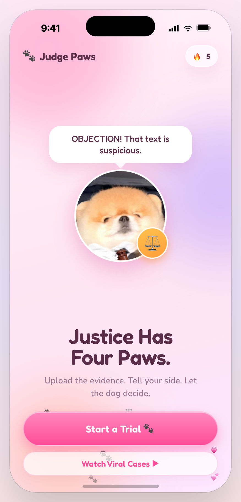
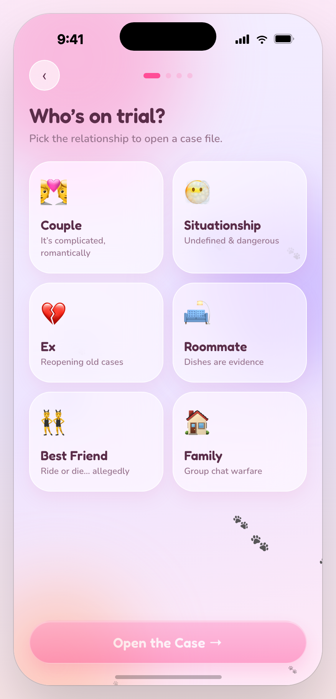
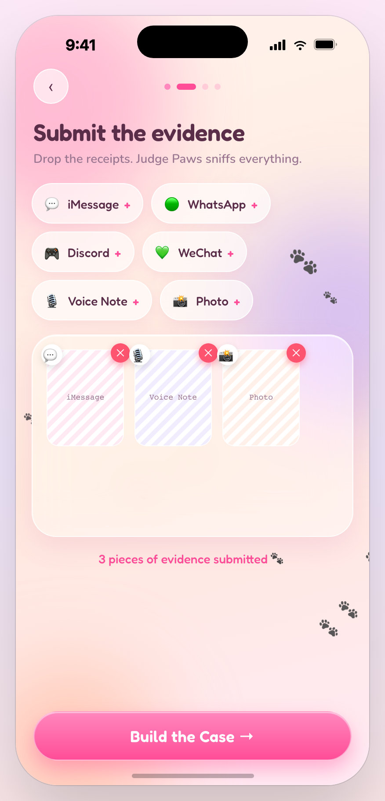
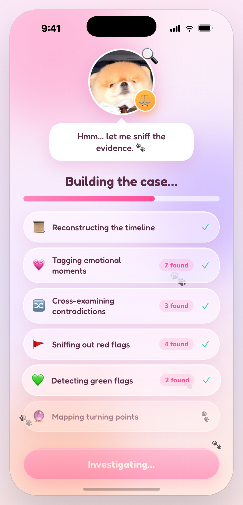
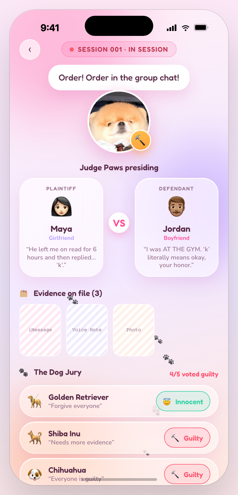
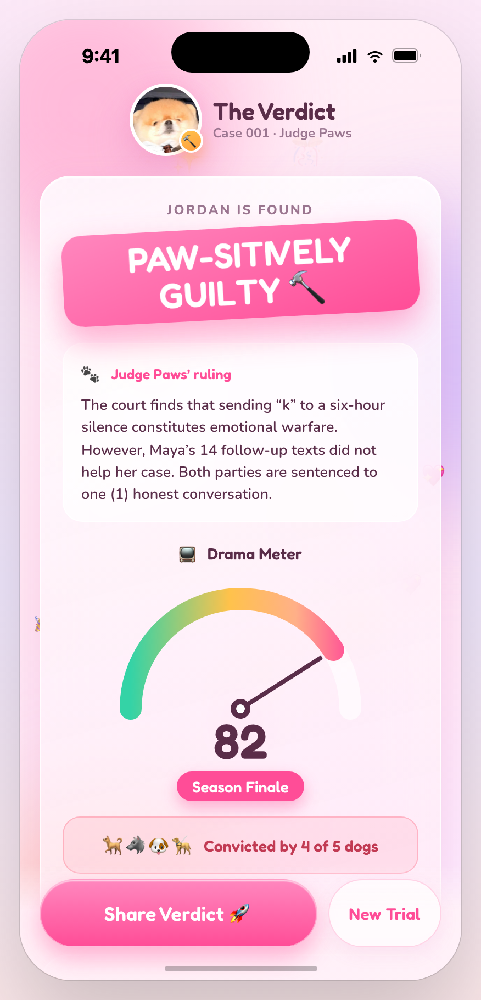

# ⚖️🐾 Judge Paws

> The first AI relationship court. Tell your side by voice or text, drop in the receipts — a fluffy AI judge and a jury of five dogs deliver a funny-but-fair verdict you can't stop sharing.

<p>
  <a href="https://judgepaws.skylarnyc.com"></a>
  
  
  
  
</p>

**🏆 Won Crowd Favorite App** at the Miro × Kiro (AWS) Hackathon, then demoed live on the **AWS × Kiro stream**. Built solo-led — concept, product, design, and a hardened full-stack backend — by **[Skylar](https://github.com/SkylarWJY)**.

<p align="center">
  
</p>

### The court, end to end

<p align="center">
  
  
  
  
  
  
</p>
<p align="center"><sub>Home · Pick the relationship · Submit evidence · Build the case · Courtroom &amp; dog jury · Verdict</sub></p>

## The idea

Every couple's fight ends the same way: *"…but who's actually right?"* There's no neutral third party, so the dispute stalls and repeats. **Judge Paws is that third party** — you screenshot the fight, upload it as evidence, and an AI judge plus a jury of five opinionated dogs return a verdict: a ruling, a drama meter, a blame split, red/green flags, a judge's note, and a share-ready card built for the group chat.

It's an entertainment product, so the whole thing is optimized for the *share*, not the session.

## How the AI plugs in

**Real evidence in, via vision.** Uploaded chat screenshots are compressed client-side and sent to `POST /api/trials` as image blocks. The model **reads them with vision** and grounds the entire verdict in the real conversation — quoting actual lines in the ruling and red flags. With no upload, it invents a plausible, relatable case.

**Tiered model routing** keeps it fast and nearly free at scale:

| Tier | Model | Why |
|------|-------|-----|
| Free | **Gemini Flash-Lite** (vision + `responseSchema`) | ~$0.0005 / verdict — cheap enough to give away |
| Premium / Savage | **Claude Opus 4.8** (vision + structured output) | best reasoning + bite for paying users |

The server picks a tier per request and **degrades gracefully** — Gemini → Claude → a bundled sample case — so a verdict *always* renders, even with zero keys configured.

```
screenshots + story  ─►  POST /api/trials  ─►  Gemini Flash-Lite  (free)   ┐
                                               Claude Opus 4.8    (premium) ┴─►  caseData
                                                                                   │
                                                        Build animation → dog jury → Verdict
```

The whole court renders from a single `caseData` object. `BuildScreen` in [`app/jp-screens-2.jsx`](app/jp-screens-2.jsx) calls the API; the server returns a verdict in that exact shape.

**Shareable verdict.** The *Share* button renders a downloadable vertical **long-image** on `<canvas>` (CJK-aware line wrapping, EN/中 versions) and hands off to the Web Share API — the viral loop is inside the product, never behind a wall.

## Under the hood

Small stack, production-hardened — because a public LLM endpoint is a liability if you don't treat it like one.

- **No build step.** React runs in-browser via Babel Standalone; screens are plain `.jsx` files. One `node server.mjs` process serves the landing page, the app, and the API. Zero bundler, zero CI to render.
- **Abuse & cost guards.** Per-IP rate limiting (token bucket, 429 on overflow) and hard caps on evidence (image count + per-image + body size, 413 on overflow) so a `curl` loop can't run up the model bill.
- **Timeouts + graceful fallback.** Every LLM call is wrapped in an `AbortController`; on timeout or error the tiered router falls through to the next engine, then to a bundled sample — the client never hangs.
- **Stripe as the source of truth.** Entitlements aren't stored on disk (Render's filesystem is ephemeral and would reset each deploy). Subscription state is read straight from Stripe, fronted by an in-memory TTL cache with stale-if-error.
- **Locked-down static serving.** Requests are resolved and whitelisted to `app/` and `web/` only — `..`-traversal to `.env` or `data/` is impossible, encoded variants included.
- **PWA freshness.** App code (`html/jsx/json`) is served `no-cache` so installed home-screen apps always get the latest; static assets cache hard. `GET /healthz` reports uptime and which providers are live.

## Bilingual &amp; installable

- **EN / 中文** throughout, with a live toggle (`app/jp-i18n.jsx`) — every verdict field, not just the UI chrome.
- **Add to Home Screen** launches fullscreen with a branded icon. On phones the app drops its device-mockup frame and fills the real screen edge-to-edge (safe-area aware); on desktop it renders inside a contain-scaled phone mockup.

## Growth model — share &amp; follow, not paywalls

Built virality-first for an audience that mostly can't pay with foreign cards, so the currency is **a share or a follow**, not money:

| Stage | What happens |
|-------|--------------|
| First verdicts | **Free** — the first one gets a gentle, skippable "follow / share Skylar" nudge |
| After the free quota | A **share-or-follow unlock**: share your verdict, or follow on Instagram / 小红书 / LinkedIn → unlimited |
| Anyone who shares | **Permanent unlock** — the shareable long-image is the growth engine and is never gated |

A **Stripe subscription** path (`/api/checkout` + webhook entitlements) is wired and can be switched on when the audience and payment rails are ready — web-only, no App Store cut.

## What's inside

```
judge-paws/
├── web/            landing page + waitlist capture
├── app/            interactive court (React in-browser, no build) + PWA manifest & icons
├── server.mjs      full-stack server — landing, app, tiered verdict API, Stripe, rate limits
├── data/           local waitlist fallback (git-ignored)
└── .env.example
```

- **`GET /`** → marketing landing page with an email waitlist
- **`GET /app/index.html`** → the interactive bilingual courtroom (installable PWA)
- **`POST /api/trials`** → a full verdict as structured JSON (rate-limited, size-capped, safety-gated)
- **`POST /api/waitlist`** → pushes emails into **beehiiv** (local `waitlist.json` fallback)
- **`POST /api/checkout` · `POST /api/stripe-webhook`** → Stripe subscription + entitlements
- **`GET /healthz`** → liveness + provider status

## Run it

```bash
npm install
cp .env.example .env      # add GEMINI_API_KEY (free tier) and/or ANTHROPIC_API_KEY
npm start                 # → http://localhost:4319
```

Keys stay server-side and never ship to the browser. With no key set, the app still runs on its bundled sample verdict. Optional: `BEEHIIV_*` for the waitlist, `STRIPE_*` for subscriptions, `GEMINI_MODEL` to pin a model.

## Deploy

Any Node host works — it's one process. A `Procfile` is included for **Render** / **Railway**: point it at the repo, set env vars, done. Production runs on Render behind `judgepaws.skylarnyc.com` (Cloudflare DNS), auto-deploying on push, with a keepalive ping to dodge cold starts.

**Privacy:** uploaded screenshots go to the verdict API for a single request and are **not persisted** server-side.

## Recognition &amp; origin

Judge Paws started at the **Miro × Kiro LA Hackathon** ([hackathon repo](https://github.com/SkylarWJY/judge-paw)), where it **won Crowd Favorite App** and was later **demoed live on the AWS × Kiro stream** across LinkedIn, Twitch and YouTube. This repo is the full-stack continuation — concept, design, frontend, and the hardened AI backend.

## License

[MIT](LICENSE)

## More from Skylar

- [**ANSIO**](https://github.com/SkylarWJY/ANSIO-conversational) — the first conversational growth engineer for creators
- [**skylarnyc.com**](https://skylarnyc.com) — NYC date-spot guide: 100 review-backed picks
- More → [github.com/SkylarWJY](https://github.com/SkylarWJY)
