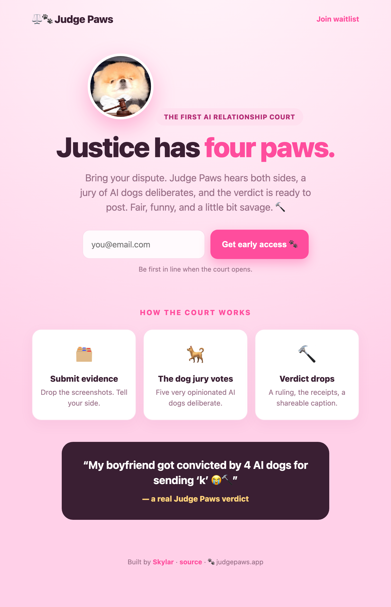

# ⚖️🐾 Judge Paws

> The first AI relationship court. Bring your dispute — a jury of AI dogs decides.

A full-stack build by **[Skylar](https://github.com/SkylarWJY)**: a landing page with
waitlist capture, an interactive courtroom app, and an AI verdict engine powered by
**Claude Opus 4.8**.

<p align="center">
  
</p>

## What's inside

```
judge-paws/
├── web/            landing page + waitlist capture
├── app/            interactive court (React, in-browser, no build step)
├── server.mjs      full-stack server — landing, app, and the API
├── data/           waitlist storage (git-ignored)
└── .env.example
```

- **`/`** — marketing landing page with an email waitlist
- **`/app/Judge Paws.html`** — the interactive courtroom demo
- **`POST /api/trials`** — Claude Opus 4.8 renders a full verdict (structured output:
  parties, scores, drama, blame %, red/green flags, ruling, judge's note, caption) with
  a safety gate for unsafe input
- **`POST /api/waitlist`** — saves early-access emails to `data/waitlist.json`

## How the AI plugs in

The court app renders entirely from one `caseData` object. `BuildScreen` in
[`app/jp-screens-2.jsx`](app/jp-screens-2.jsx) calls `POST /api/trials`; the server asks
Claude to hold court and return a verdict in the exact `caseData` shape. If the backend
is unreachable, the app falls back to a bundled sample case — so it never breaks.

```
relationship type + evidence  ─►  /api/trials  ─►  Claude Opus 4.8 (structured)
                                                        │
                                          full verdict → caseData → Courtroom + Verdict
```

## Run it

```bash
npm install
cp .env.example .env      # paste your ANTHROPIC_API_KEY
npm start                 # → http://localhost:4319
```

Open the landing page, join the waitlist, or jump to `/app/Judge Paws.html` to hold a
real, AI-rendered trial. The API key stays server-side and never ships to the browser.

## Origin

Judge Paws started as a project for the **Miro × Kiro LA Hackathon**
([hackathon repo](https://github.com/SkylarWJY/judge-paw)). This repo is the full-stack
continuation — concept, design, frontend, and AI backend by Skylar.

## License

[MIT](LICENSE)
